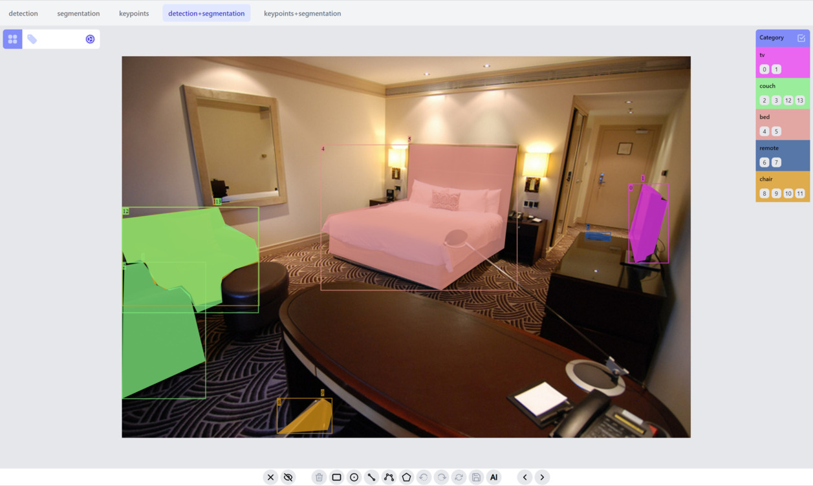

# Demo app of [@zityspace/react-annotate](https://github.com/ZitySpace/react-annotate) library

Go to this [Vercel link](https://react-annotate-demo.vercel.app/) to play with the demo. On the top bar you can select different task to try preview and modify the annotations.

You need to implement the logic of hosting the annotations, it can be a backend api server, or some local files. Based on that, you may
also need to apply some transformations to transform annotations into the input format react-annotate library accepts.

We use a backend api service ([repo](https://github.com/ZitySpace/react-annotate-demo-backend), openapi [docs](https://react-annotate-demo-backend.vercel.app/docs)) to host the annotations for this demo. Right now it is only for demo purpose so no data management functionalities.

Go to [react-annotate](https://github.com/ZitySpace/react-annotate) for details of how to use the library and how to annotate `points, lines, boxes, polylines, masks and keypoints`.
